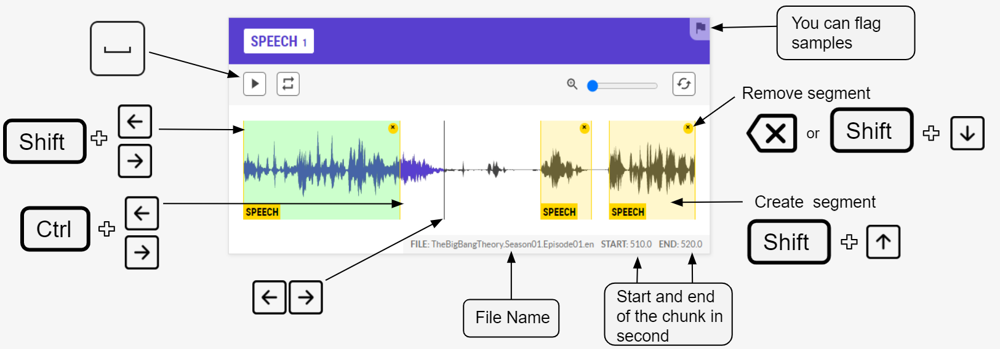

## Installation

Setup a `conda` environment with Python 3.8.
Install `develop` branch of [`pyannote.audio`](https://github.com/pyannote/pyannote-audio/tree/develop)
```bash
pip install https://github.com/pyannote/pyannote-audio/archive/develop.zip
```

Install [`prodigy`](https://prodi.gy/)

## Usage

```bash
prodigy audio.vad my_dataset path_to_my_corpus/
```

Use `-pipeline my_pipeline` to use your model's pipeline.

## Short-cuts and Commands


| Key 1  | Key 2 | Command |
| ------------- | ------------- | ------------ |
| Arrows left/right | [W]  | Move Cursor [speed up] |
| Shift  | Arrows left/right  | Change start of current segment      |
| Control  | Arrows left/right  | Change end of current segment      |
| Arrows up/down |  | Change current segment to the next/precedent one |
| Shift  | Arrows up/[down]  | Create [or remove] segment |
| Backspace |  | Remove current segment |
| Spacebar |  | Play/pause audio |
| Escape | | Ignore this sample |
| Enter | | Validate annotation |
