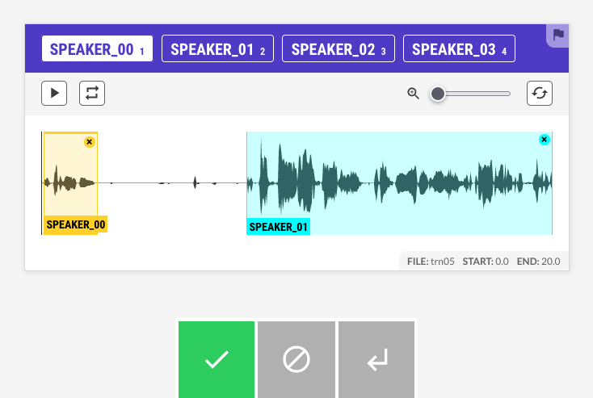
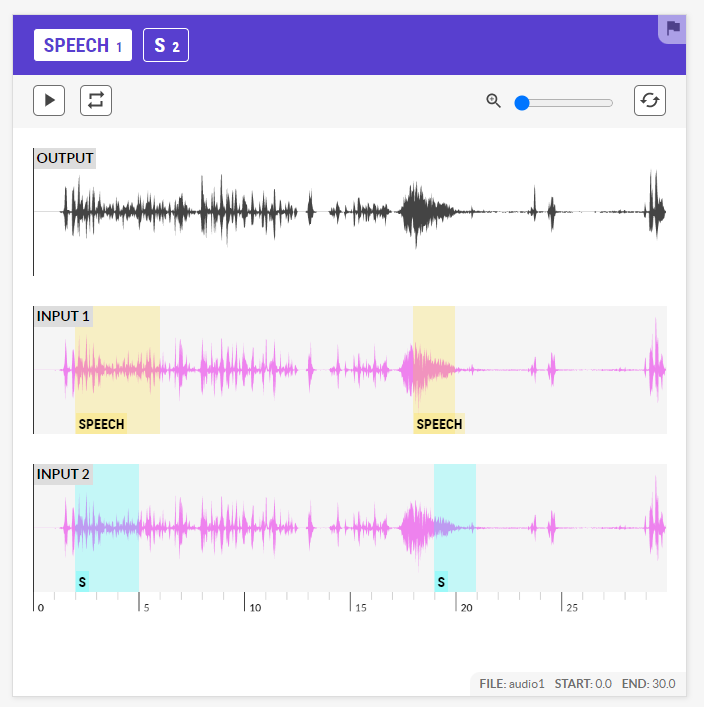

# Annotating your own data with Prodigy

Manually annotating audio data is time consuming.
`pyannote.audio` comes with a bunch of [Prodigy](https://prodi.gy) recipes that should speed things up a bit.

## Pre-annotate with a pretrained pipeline

`pyannote.audio` recipe will stream in `.wav` files in chunks and apply [a pretrained pipeline](https://huggingface.co/models?other=pyannote-audio-pipeline). You can then adjust the regions manually if needed.

```bash
prodigy pyannote.audio dataset /path/to/audio/directory pyannote/speaker-segmentation
```



## Merge multiple annotations

`pyannote.review` recipe take as many annotation files, using the RTTM file format, as you want and let you compare and choose which ones are best within the same stream as `pyannote.audio` recipe.
Click on a segment of the annotation files to add it to the ouput audio, or on "Input X" to add all segments at once.
There is a "diarization" option to make a optimal one-to-one mapping between the first annotation and all others.

```bash
prodigy pyannote.review dataset /path/to/audio/directory /path/to/annotations/1.rttm,/path/to/annotations/2.rttm,/path/to/annotations/3.rttm
```



## Compare reference and hypothesis annotations

`pyannote.diff` recipe take one reference file and one hypothesis file, using the RTTM file format, and focus where there are the most errors among missed detections, false alarms and confusions.
You can filter on one or more error types and their minimum duration with the corresponding options.
There is also a "diarization" option to make a optimal one-to-one mapping between reference and hypothesis.

```bash
prodigy pyannote.diff dataset /path/to/audio/directory /path/to/reference.rttm /path/to/hypothesis.rttm
```


## RTTM file

RTTM files contain one line per speech turn, using the following convention:

```bash
SPEAKER {uri} 1 {start_time} {duration} <NA> <NA> {speaker_id} <NA> <NA>
```
* uri: file identifier (as given by pyannote.database protocols)
* start_time: speech turn start time in seconds
* duration: speech turn duration in seconds
* confidence: confidence score (can be anything, not used for now)
* gender: speaker gender (can be anything, not used for now)
* speaker_id: speaker identifier
